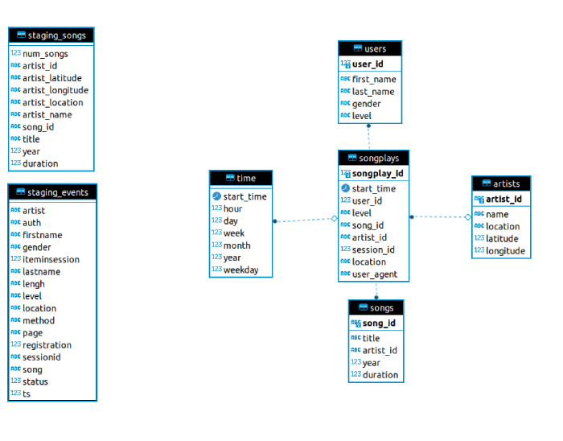
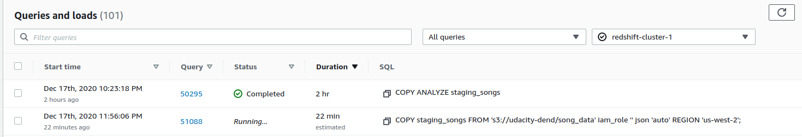

# Data Warehousing on Redshift | Udacity Project 03

Main goals of this project:  
- To Define fact and dimension tables using the star schema for analytics
- Migrate JSON data from S3 buckets to Redshift using Python and SQL.

## Introduction
A fictional music streaming startup, Sparkify, has grown their user base and song database and want to move their processes and data onto the cloud. Their data resides in S3, in a directory of JSON logs on user activity on the app, as well as a directory with JSON metadata on the songs in their app.

As their data engineer, you are tasked with building an ETL pipeline that extracts their data from S3, stages them in Redshift, and transforms data into a set of dimensional tables for their analytics team to continue finding insights in what songs their users are listening to.

## Project Description

In this project, you'll apply what you've learned on data warehouses and AWS to build an ETL pipeline for a database hosted on Redshift. To complete the project, you will need to load data from S3 to staging tables on Redshift and execute SQL statements that create the analytics tables from these staging tables.

## Project Datasets

### Song Dataset 

The first dataset is a subset of real data from the [Million Song Dataset](http://millionsongdataset.com/). 
Each file is in JSON format and contains metadata about a song and the artist of that song.

#### s3://udacity-dend/song_data

### Log Dataset
The second dataset consists of log files in JSON format generated by an event simulator based on the songs in the dataset above. These simulate app activity logs from an imaginary music streaming app based on configuration settings.

#### s3://udacity-dend/log_data

## Database design

### Staging tables
Entended to acomodate the raw data

- **staging_songs**: Holds song data from s3://udacity-dend/song_data
- **staging_events**: Holds events related to an music streaming app from s3://udacity-dend/log_data

### Fact and Dimention tables
Using the star schema because the main focus is analytics, although I can't how the data could be normalized further (location and user_agent are a project requirement for the fact table). 

- **songplays**: Main table, where the facts are stored
- **users**: As the name implies, this table holds data about the users of the streaming platform
- **time**: Timestamps of records in songplays broken down into specific units
- **artists**: As the name implies, the colection of artists available in the platform 
- **songs**: As the name implies, songs data

## Setting up the environment:

### Requirements:
- An active Redshift cluster, instructions on how to setup this: [Here](https://docs.aws.amazon.com/redshift/latest/gsg/getting-started.html)
- [Anaconda](https://www.anaconda.com/)

### Conda
- Navigate to the project folder
- Create the environment: `conda env create -f environment.yml`
- Activate the new environment: `conda activate redshift_dwh`

### Database
- Create a new config file named **dwh.json** using the template config file **dwh.json.template**
- Activate the conda environment, if not already active: `conda activate redshift_dwh`
- Navigate to the project folder
- Create the tables: `python3 create_tables.py`

## ETL
**Warning!** Because of the dataset size the initial data import (from S3 to Redshift) from  will take hours, so if you have access to an Linux environment I recomend runnig it under [Screen](https://linuxize.com/post/how-to-use-linux-screen/) or [Tmux](https://github.com/tmux/tmux/wiki).

If you dont have the time or just want to check if everything works, change the **song_data** value on the config file from **s3://udacity-dend/song_dat"** to **s3://udacity-dend/song_data/A/A/A**

- Run the ETL pipeline: `python3 etl.py`

